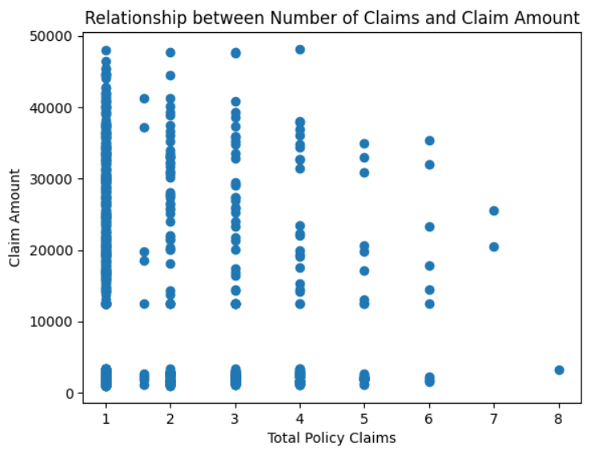
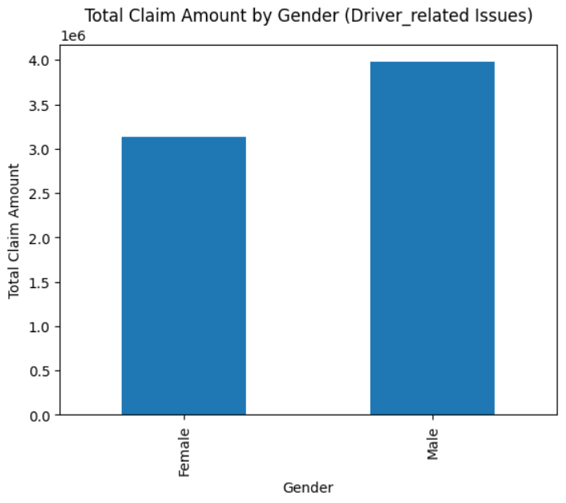
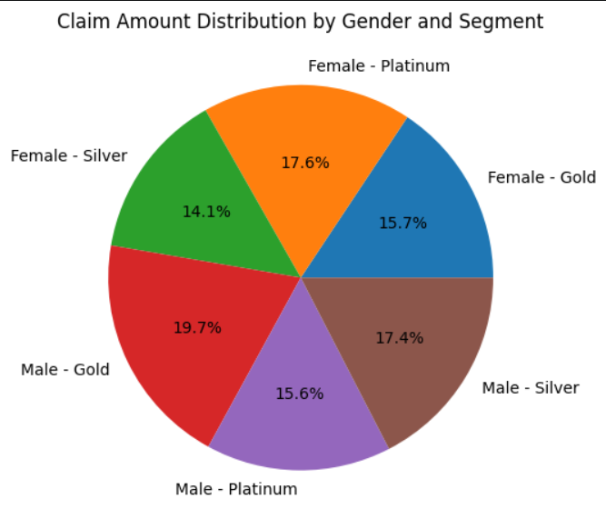
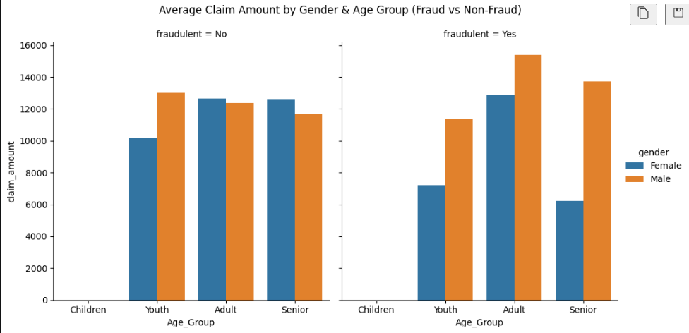

# Insurance Claims Analysis 📊

## 📌 Project Overview
This project analyzes insurance claims data to uncover patterns in claim behavior, fraud detection, and customer segmentation.

## 🎯 Objectives
- Analyze claim trends over time
- Detect fraudulent claims
- Understand customer segments
- Perform statistical hypothesis testing

## 🛠️ Tools & Technologies
- Python (Pandas, NumPy)
- Matplotlib, Seaborn
- Scipy (Statistical Testing)

## 📊 Key Insights
- No significant difference in claim amount across gender
- No relationship between number of claims and claim amount
- Significant increase in claim amount in recent year
- Fraud patterns vary across age groups

## 📁 Files
- `Insurance_claims_Analysis.ipynb` → Complete analysis
## 📊 Visualizations

## 📌 Conclusion
This project demonstrates end-to-end data analysis including data cleaning, EDA, visualization, and hypothesis testing.
